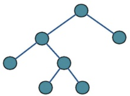

# 트리


## 종류 

- Full - 트리의 모든 노드가 0개 또는 2개의 자식의 가지는 경우

  

- Complete - 마지막 레벨을 제외하고 나머지 노드가 꽉 찬 상택 (마지막 노드는 왼쪽에 몰려 있어야 함)

  

- Perfect - 모든 레벨의 노드가 꽉 찬 상태 (Full + Complete)

  

- Balance - 트리 왼쪽, 오른쪽의 높이차가 모두 1만큼 나는 상태


## Birnary Search Tree (이진트리탐색)

- 이진트리는 가지가 최대 2개
- 이진탐색트리는 탐색 기능이 추가됨
- Node를 기준으로 왼쪽은 Node보다 작은 값, 오른쪽은 Node보다 큰 값
- 이렇게 미리 배치가 되어있어서 Balanced가 보장되는 자료구조

```javascript
export class BinarySearchTree {
  root = null;

  #insert(node, value) {
    if (node.value > value) {
      // 루트노드보다 작은 값이면
      if (node.left) {
        this.#insert(node.left, value);
      } else {
        node.left = new Node(value);
      }
    } else {
      // 루트노드보다 큰 값이면
      if (node.right) {
        this.#insert(node.right, value);
      } else {
        node.right = new Node(value);
      }
    }
  }
  insert(value) {
    // 어떤 값을 넣으려할때, 일단 어디에 넣을지 모르겠다.
    // 그래서 왼팔, 오른팔한테 맡긴다.
    // 근데 만약 왼팔 오른팔이 없으면 거기다가 넣는다.
    if (!this.root) {
      this.root = new Node(value);
    } else {
      this.#insert(this.root, value);
    }
    // 숙제: 이미 넣은 값을 넣은 경우 에러 처리(alert, throw)
  }

  #search(node, value) {
    if (node.value > value) {
      // 더 작은값 찾을때
      if (!node.left) {
        return null;
      }
      if (node.left.value === value) {
        return node.left;
      }
      return this.#search(node.left, value);
    } else {
      if (!node.right) {
        return null;
      }
      if (node.right.value === value) {
        return node.right;
      }
      return this.#search(node.right, value);
    }
  }

  search(value) {
    // 어떤 값을 찾으려할때, 일단 어디에 있는지 모르겠다.
    // 그래서 왼팔, 오른팔한테 맡긴다.
    // 찾으면 그 노드 return, 못찾으면 null return
    if (!this.root) {
      return null;
    }
    if (this.root.value === value) {
      return this.root;
    }
    return this.#search(this.root, value);
  }

  #remove(node, value) {
    if (!node) {
        // 제거할 값이 bst에 존재하지 않는 경우
        return null; // 지울 값이 존재 안 하면 false return
    }
    if (node.value === value) { // 자식 입장
        // 지울 값을 찾은 경우
        if (!node.left && !node.right) {
            // 1. 양팔 x
            return null;
        } else if (!node.left) { // 2.왼팔만 없는 경우
            return node.right;
        } else if (!node.right) { // 3.오른팔만 없는 경우
            return node.left;
        } else { // 4. 양팔 다 있는 경우
            let exchange = node.left;
            while (exchange.right) {
                exchange = exchange.right;
            }
            const temp = node.value;
            node.value = exchange.value;
            exchange.value = temp;
            node.left = this.#remove(node.left, temp);
            return node;
        }
    } else { // 부모 입장
        if (node.value > value) {
            node.left = this.#remove(node.left, value)
            return node;
        } else {
            node.right = this.#remove(node.right, value);
            return node;
        }
    }
}
remove(value) {
    // 1. leaf(양팔 다 없음) -> 제거
    // 2. leaf x, 왼팔이 없다 -> 오른팔 끌어올린다
    // 3. leaf x, 오른팔이 없다 -> 왼팔 끌어올린다
    // 4. leaf x, 양팔 다 있다 -> 왼팔에서 가장 큰 애와 바꾼다,leaf를 지운다
    this.root = this.#remove(this.root, value);
    return // 숙제로 length return하게
}
}
class Node {
  left = null;
  right = null;
  constructor(value) {
    this.value = value;
  }
}

const bst = new BinarySearchTree();
bst.insert(8);
bst.insert(10);
bst.insert(3);
bst.insert(1);
bst.insert(14);
bst.insert(6);
bst.insert(7);
bst.insert(4);
bst.insert(13);

```


## Binary Heap (이진 힙)

- Binary Heap은 Complete Binary Tree를 사용하고 왼쪽부터 가득 채운 트리
- 자식 Index = (부모 Index * 2) + 1 or (부모 Index * 2) + 2
- 부모 Index = Math.floor((부모 Index-1)/2)

```javascript
class MaxHeap { // 최대힙
  arr = []

  #reheapUp(index) {
      if (index > 0) {
          const parentIndex = Math.floor((index - 1) / 2);
          if (this.arr[index] > this.arr[parentIndex]) {
              // 값 바꾸기
              const temp = this.arr[index];
              this.arr[index] = this.arr[parentIndex];
              this.arr[parentIndex] = temp;
              this.#reheapUp(parentIndex);
          }
      }
  }
  insert(value) {
      const index = this.arr.length;
      this.arr[index] = value;
      this.#reheapUp(index);
  }
  #reheapDown(index) {
      const leftIndex = index * 2 + 1;
      if (leftIndex < this.arr.length) {
          const rightIndex = index * 2 + 2;
          const bigger = this.arr[leftIndex] > this.arr[rightIndex] ? leftIndex : rightIndex;
          if (this.arr[index] < this.arr[bigger]) {
              const temp = this.arr[index];
              this.arr[index] = this.arr[bigger];
              this.arr[bigger] = temp;
              this.#reheapDown(bigger);
          }
      }
  }
  remove() { // 루트 삭제
      if (this.arr.length === 0) {
          return false;
      }
      if (this.arr.length === 1) {
          return this.arr.pop();
      }
      const root = this.arr[0];
      this.arr[0] = this.arr.pop();
      this.#reheapDown(0);
      return root;
  }
  sort() { // 힙 정렬
      const sortedArray = [];
      while (this.arr.length > 0) {
          sortedArray.push(this.remove());
      }
      return sortedArray;
  }
  search(value) {
      for (let i = 0; i < this.arr.length; i++) {
          if (this.arr[i] === value) {
              return i;
          }
      }
      return null;
  }
  update(value, newValue) {
      const index = this.search(value);
      if (index === null) {
          return false;
      }
      this.arr[index] = newValue;
      for (let i = Math.floor(this.arr.length / 2 - 1); i >= 0; i--) { // O(1/2n)
          this.#heapify(i); // O(1)
      }
  }
  removeValue(value) { // 특정 값 삭제
      const index = this.search(value);
      if (index === null) {
          return false;
      }
      this.arr.splice(index, 1);
      for (let i = Math.floor(this.arr.length / 2 - 1); i >= 0; i--) { // O(1/2n)
          this.#heapify(i); // O(1)
      }
  }
  #heapify(index) {
      const leftIndex = index * 2 + 1;
      const rightIndex = index * 2 + 2;
      const bigger = (this.arr[leftIndex] || 0) > (this.arr[rightIndex] || 0)
          ? leftIndex : rightIndex;
      console.log(index, this.arr[index], this.arr[bigger]);
      if (this.arr[index] < this.arr[bigger]) {
          const temp = this.arr[index];
          this.arr[index] = this.arr[bigger];
          this.arr[bigger] = temp;
      }
  }
}

const heap = new MaxHeap();
heap.insert(8);
heap.insert(19);
heap.insert(23);
heap.insert(32);
heap.insert(45);
heap.insert(56);
heap.insert(78);
heap.removeValue(32);
heap;
```

